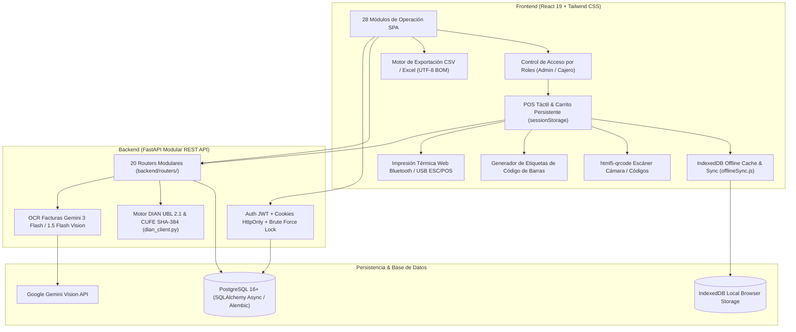

# 🏪 JRPOS — Arquitectura del Sistema (v11.3)

Sistema POS modular, offline-first y responsivo para tiendas de abarrotes, comercio minorista y droguerías en Colombia.

---

## 🚀 Capacidades Principales (v11.3)

### 1. Resiliencia & Modo Offline (IndexedDB)
* **Monitoreo de Red en Tiempo Real:** Insignia interactiva en el Header global con estados `En línea` / `Offline` y reconexión automática.
* **Caché Local de Productos:** El catálogo completo se almacena en `IndexedDB` (`STORE_PRODUCTS`) para permitir búsquedas y escaneos de productos incluso con cortes de internet.
* **Cola de Ventas Desconectadas:** Ventas realizadas sin conexión se resguardan en `sales_queue` y se envían automáticamente al backend con `POST /sales` al detectar el evento `online`.
* **Recibos Térmicos Offline:** Generación e impresión de tickets POS 58mm en modo desconectado con numeración `OFF-XXXXXX (Local)`.

### 2. Ergonomía de Caja & Punto de Venta
* **Escaneo de Código de Barras Dual:**
  * Soporte nativo para lectores ópticos USB / Bluetooth con atajo <kbd>F2</kbd>.
  * Escáner de cámara integrado vía `html5-qrcode` para dispositivos móviles y tablets.
* **Audio Feedback:** Tono sintetizado con Web Audio API (1400Hz, 80ms) en cada escaneo exitoso.
* **Atajos de Teclado para Cajero:**
  * <kbd>F2</kbd>: Foco instantáneo en campo de código de barras.
  * <kbd>F4</kbd>: Vaciar carrito de compras.
  * <kbd>F9</kbd>: Abrir modal de cobro y pago.
  * <kbd>Esc</kbd>: Cerrar cualquier modal o lector activo.
* **Denominaciones Rápidas COP:** Botones de efectivo en modal de pago (*Exacto, $10.000, $20.000, $50.000, $100.000*) con cálculo instantáneo de cambio.

### 3. Gestión de Inventario & Etiquetas
* **Generador de Etiquetas con Código de Barras:** Módulo para impresión directa de pliegos adhesivos A4 (filas de 3 etiquetas) y rollos continuos térmicos con nombre del producto, código de barras SVG y precio en pesos colombianos.
* **Exportación CSV / Excel Universal:** Descarga con un clic del catálogo completo de inventario y del reporte consolidado de facturación con codificación UTF-8 BOM.

---

## 🛡️ Matriz de Seguridad y Roles (RBAC)

| Módulo / Ruta | Cajero | Administrador | Alcance y Funcionalidad |
|---|:---:|:---:|---|
| `/dashboard` (Panel) | ✅ | ✅ | Visualización de KPIs diarios y alertas de stock |
| `/pos` (POS Venta) | ✅ | ✅ | Carrito persistente, escaneo barcode/cámara, retención, atajos F2/F4/F9 y cobro |
| `/facturas` (Escanear Factura IA) | ✅ | ✅ | OCR de facturas de compra y carga directa a inventario |
| `/inventario` (Inventario) | ✅ | ✅ | Consulta de productos, precios, exportar CSV e impresión de etiquetas barcode |
| `/clientes` & `/proveedores` | ✅ | ✅ | Directorio comercial y contactos directos |
| `/reportes` (Reportes) | ✅ | ✅ | Histórico de ventas, KPIs comerciales, filtros por método y exportación CSV |
| `/marcacion` (Reloj Control) | ✅ (Marcación) | ✅ (Registros) | Control de asistencia laboral |
| `/gastos` (Gastos/Pagos) | ✅ | ✅ | Registro de salidas de caja menores |
| `/recogidas` (Caja y Arqueo) | ✅ (Caja actual) | ✅ (Histórico Z) | Apertura con base, retiros parciales y Arqueo Cierre Z |
| `/creditos` (Fiados) | ✅ | ✅ | Cartera de deudores, abonos y cobro por WhatsApp |
| `/servicios` (Servicios) | ✅ | ✅ | Recargas, pagos y corresponsal bancario |
| `/ordenes-venta` & `/garantias` | ✅ | ✅ | Cotizaciones y gestión de garantías |
| `/ordenes-compra` | ✅ | ✅ | Pedidos a proveedores |
| `/carga-masiva` & `/actualizacion-masiva` | ❌ | ✅ | Carga Excel/CSV y cambios masivos de precio |
| `/promociones` (Promociones/Ofertas) | ❌ | ✅ | Configuración de descuentos y reglas de combo |
| **Facturación DIAN** (FE, POS, Nómina, RADIAN, Certificado) | ❌ | ✅ | Gestión fiscal, resoluciones y llaves digitales |
| `/comisiones` | ❌ | ✅ | Reglas de comisión por vendedor y liquidación |
| `/usuarios` & `/configuracion` | ❌ | ✅ | Gestión de usuarios, roles y datos de la tienda |

