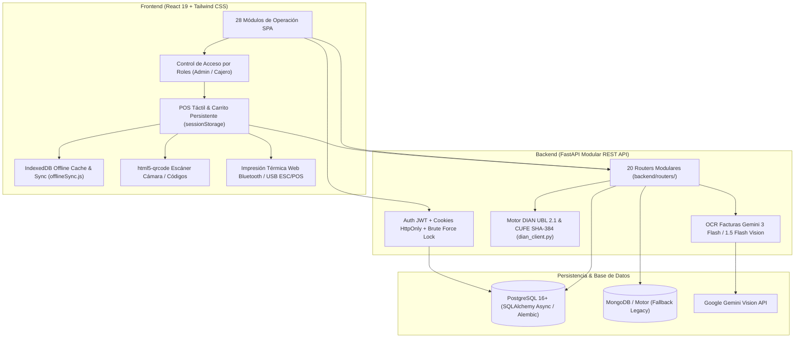

# 🏪 JRPOS — Arquitectura del Sistema

Sistema POS modular y responsivo para tiendas de abarrotes en Colombia.

---

## 🛡️ Matriz de Seguridad y Roles (RBAC)

| Módulo / Ruta | Cajero | Administrador | Alcance y Funcionalidad |
|---|:---:|:---:|---|
| `/dashboard` (Panel) | ✅ | ✅ | Visualización de KPIs diarios y alertas de stock |
| `/pos` (POS Venta) | ✅ | ✅ | Carrito persistente, escaneo barcode/cámara, retención y cobro |
| `/facturas` (Escanear Factura IA) | ✅ | ✅ | OCR de facturas de compra y carga directa a inventario |
| `/inventario` (Inventario) | ✅ | ✅ | Consulta de productos, precios y actualización de existencias |
| `/clientes` & `/proveedores` | ✅ | ✅ | Directorio comercial y contactos directos |
| `/reportes` (Reportes) | ✅ | ✅ | Histórico de ventas y exportación de datos |
| `/marcacion` (Reloj Control) | ✅ (Marcación) | ✅ (Registros) | Control de asistencia laboral |
| `/gastos` (Gastos/Pagos) | ✅ | ✅ | Registro de salidas de caja menores |
| `/recogidas` (Caja y Arqueo) | ✅ (Caja actual) | ✅ (Histórico Z) | Apertura con base, retiros parciales y Arqueo Cierre Z |
| `/creditos` (Fiados) | ✅ | ✅ | Cartera de deudores, abonos y cobro por WhatsApp |
| `/servicios` (Servicios) | ✅ | ✅ | Recargas, pagos y corresponsal bancario |
| `/ordenes-venta` & `/garantias` | ✅ | ✅ | Cotizaciones y gestión de garantías |
| `/ordenes-compra` | ✅ | ✅ | Pedidos a proveedores |
| `/carga-masiva` & `/actualizacion-masiva` | ❌ | ✅ | Carga Excel/CSV y cambios masivos de precio |
| `/promociones` (Promociones/Ofertas) | ❌ | ✅ | Configuración de descuentos y reglas de combo |
| **Facturación DIAN** (FE, POS, Nómina, RADIAN, Certificado) | ❌ | ✅ | Gestión fiscal, resoluciones y llaves digitales |
| `/comisiones` | ❌ | ✅ | Reglas de comisión por vendedor y liquidación |
| `/usuarios` & `/configuracion` | ❌ | ✅ | Gestión de usuarios, roles y datos de la tienda |

---

## 📦 Gobernanza de Habilidades (SuperDuperSkills)
- **Suite de Calidad y Arquitectura**: Invocada para compresión de tokens (`caveman`), simplicidad (`ponytail`), validación continua (`harness`) y diagramación (`archify`).
- **Especializadas**: `fastapi-expert`, `postgres-patterns`, `react-patterns`, `tailwind-theme-builder`, `security-review`, `quality-playbook`.
