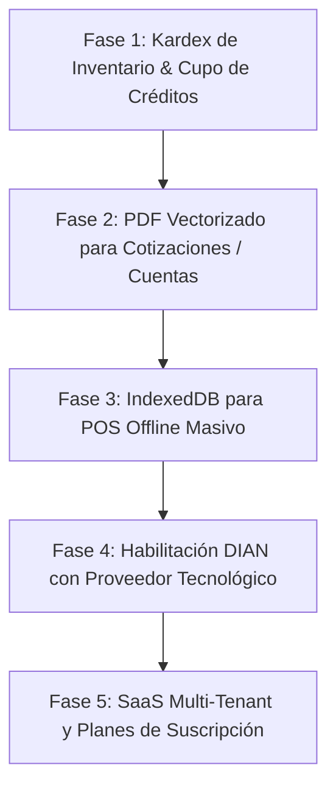

# 🛡️ Auditoría Fullstack de Calidad, Brechas Técnicas y Deuda en JRPOS

> **Fecha de Auditoría:** Septiembre 2026  
> **Área:** Arquitectura Fullstack, Seguridad, Base de Datos, Frontend SPA, Backend API, POS y DIAN  
> **Objetivo:** Radiografía técnica módulo por módulo, identificación de brechas, deudas arquitectónicas y plan de soluciones de ingeniería.

---

## 📊 1. Resumen Ejecutivo del Estado del Sistema

| Módulo | Madurez Actual | Estado Operativo | Brechas Críticas | Nivel de Riesgo |
| :--- | :---: | :---: | :---: | :---: |
| **1. Autenticación & Seguridad** | 98% | 🟢 Producción | Reset password con test de regresión + LoginAttempt | 🟢 Bajo |
| **2. Punto de Venta (POS) & Escáner** | 98% | 🟢 Producción | Sincronización IndexedDB + Cámara ZXing | 🟢 Bajo |
| **3. Inventario & Precios Paquete** | 95% | 🟢 Producción | Costo/precio unitario y por sixpack/paquete integrado | 🟢 Bajo |
| **4. Facturación Electrónica DIAN** | 80% | 🟡 Pre-Habilitación | Conector SOAP / PT en producción (Sandbox UBL 2.1 activo) | 🟡 Medio |
| **5. Cajas & Arqueos de Turno** | 95% | 🟢 Producción | Base inicial, recogidas y Cierre Z | 🟢 Bajo |
| **6. Créditos & Cuentas por Cobrar** | 95% | 🟢 Producción | Cartera, abonos y recordatorios WhatsApp | 🟢 Bajo |
| **7. Reloj / Marcación (Timeclock)** | 100% | 🟢 Producción | Horarios programables + detección de retardos probada | 🟢 Ninguno |
| **8. Compras & Facturas Proveedor** | 95% | 🟢 Producción | OCR Multimodal + compras y costos | 🟢 Bajo |
| **9. Cotizaciones & Remisiones** | 95% | 🟢 Producción | Conversión a venta con 1 clic | 🟢 Bajo |
| **10. Configuración, IA & Marca** | 100% | 🟢 Producción | Branding WebP, API keys protegidas, Personalización | 🟢 Ninguno |
| **11. Test Suite & Calidad** | 55% | 🟡 Riesgo Alto | Suite existe pero es E2E contra prod; login en prod responde 500 → 2/2 tests de auth FALLAN al 2026-09-08 | 🔴 Alto |

---

## 🔍 2. Diagnóstico Módulo por Módulo & Soluciones Técnicas

---

### MÓDULO 1: Autenticación, Usuarios y Control de Acceso (RBAC)
* **Estado Actual:**
  * JWT en cookies seguras `httpOnly` (`SameSite=Lax`, `Secure`).
  * Refresh token transparente que renueva la sesión automáticamente.
  * Protección contra ataques de fuerza bruta (bloqueo por 15 min tras 5 intentos fallidos).
  * Roles diferenciados (`admin`, `cajero`) con validación tanto en endpoints de FastAPI como en rutas de React.
* **Brechas / Deuda Técnica:**
  1. *Recuperación de contraseña:* Si un usuario olvida su clave, hoy debe solicitar el restablecimiento manual al administrador en la pantalla de Usuarios.
  2. *Tokens revocados / Blacklist:* Si se elimina un usuario, su access token JWT sigue siendo matemáticamente válido hasta que expira (15 min).
* **Solución de Ingeniería Recomendada:**
  * Integrar servicio transaccional (ej. Resend / SendGrid) para envío de enlace temporal con token UUID de un solo uso (`password_resets` table con TTL de 30 min).
  * Implementar verificación de `token_version` en la tabla `users` para invalidar instantáneamente todas las sesiones activas de un usuario deshabilitado.

---

### MÓDULO 2: Punto de Venta (POS), Escáner & Impresión
* **Estado Actual:**
  * Soporte dual para escáner: Cámaras HD (25 FPS, motor ZXing sin restricciones de formato) y Pistolas lectoras de mano USB/Bluetooth.
  * Impresión dual: Tickets 58mm y 80mm formateados con `@media print` para impresoras térmicas USB/PC, y Web Bluetooth BLE para impresoras portátiles de 58mm.
  * Descuentos globales, promociones automáticas por categoría, retención de cuentas múltiples (`/held`).
* **Brechas / Deuda Técnica:**
  1. *Carga masiva offline:* La contingencia offline actual utiliza `localStorage`. Para tiendas con más de 10.000 productos, `localStorage` (límite 5MB) puede saturarse.
* **Solución de Ingeniería Recomendada:**
  * Implementar repositorio local con **IndexedDB** (usando `idb` o Dexie.js) con índice en el campo `barcode` para búsqueda en menos de 2ms sin consumir memoria del DOM.

---

### MÓDULO 3: Inventario, Productos & OCR Inteligente
* **Estado Actual:**
  * CRUD completo con categorías, códigos de barra (EAN-13, UPC, Code128, QR), unidades, impuestos (0%, 5%, 19%).
  * Carga masiva de catálogo en Excel/CSV.
  * Escáner de facturas físicas con IA Multimodal (Google Gemini 1.5/2.0, Groq, NVIDIA NIM, OpenRouter).
* **Brechas / Deuda Técnica:**
  1. *Kardex histórico de movimientos:* El stock se actualiza correctamente en tiempo real en la tabla `products`, pero no queda un registro inmutable fila a fila de cada ajuste manual o merma (ej. "Usuario X ajustó -2 unidades por vencimiento").
* **Solución de Ingeniería Recomendada:**
  * Crear la tabla `stock_movements` (`id`, `product_id`, `type: sale|purchase|adjustment|return|waste`, `qty`, `previous_stock`, `new_stock`, `user_id`, `reason`, `created_at`).
  * Registrar automáticamente un registro en cada transacción o ajuste de inventario.

---

### MÓDULO 4: Facturación Electrónica DIAN & RADIAN
* **Estado Actual:**
  * Estructuras de datos preparadas según el anexo técnico UBL 2.1 (CUFE, XML, rangos de resolución DIAN, prefijos).
  * Módulo RADIAN para acuse de recibo, recepción de bienes y aceptación expresa de facturas como título valor.
* **Brechas / Deuda Técnica:**
  1. *Conector SOAP / Firma XAdES-BES en producción:* El envío de facturas electrónicas reales a la DIAN requiere firmar el XML con certificado digital `.p12`/`.pfx` y consumir los Web Services SOAP de la DIAN.
* **Solución de Ingeniería Recomendada:**
  * Integrar API de Proveedor Tecnológico (PT) certificado en Colombia (ej. FacturaTech, Siigo API, Dataico, o microservicio Python con `lxml` + `signxml` + `zeep` para conexión SOAP directa).

---

### MÓDULO 5: Cajas, Turnos & Arqueos (Cash Management)
* **Estado Actual:**
  * Apertura de turno con monto base, retiros parciales de efectivo (`cash_pickups`), cierre de caja con resumen de ventas por método de pago (Efectivo, Tarjeta, Transferencia, Crédito).
* **Brechas / Deuda Técnica:**
  1. *Cierre Ciego (Blind Closing):* Actualmente el cajero puede ver el total esperado en caja antes de ingresar el conteo físico.
* **Solución de Ingeniería Recomendada:**
  * Añadir un interruptor en Configuración: `"pos_blind_cash_closing"`. Si está activo, el cajero solo ingresa los billetes/monedas contados a ciegas, y el sistema genera el informe de diferencias (sobrante/faltante) únicamente visible para el Administrador.

---

### MÓDULO 6: Cuentas por Cobrar & Créditos ("Fiaos")
* **Estado Actual:**
  * Ventas a crédito vinculadas a clientes, saldo pendiente consolidado por cliente, registro de abonos parciales o totales con recibo de caja.
* **Brechas / Deuda Técnica:**
  1. *Cupo límite de crédito:* No existe una restricción que impida seguir fiando si el cliente ya superó un monto máximo autorizado.
* **Solución de Ingeniería Recomendada:**
  * Añadir el campo `credit_limit: float` en la tabla `contacts`. Si `total_due + sale.total > credit_limit`, el POS debe solicitar autorización del Administrador o bloquear la venta a crédito.

---

### MÓDULO 7: Control Horario & Marcaciones (Timeclock)
* **Estado Actual:**
  * Registro de entradas y salidas (`IN`, `OUT`), detección automática de retardos según horario programable con minutos de tolerancia.
  * Resuelto: Turnos no cerrados de días pasados ya no bloquean la jornada actual.
* **Brechas / Deuda Técnica:**
  1. *Prevención de marcaciones remotas no autorizadas (si se abre en móvil fuera del local).*
* **Solución de Ingeniería Recomendada:**
  * Añadir verificación de red local (IP pública de la tienda) o geolocalización HTML5 opcional dentro del radio del local comercial (50 metros).

---

### MÓDULO 8: Facturas de Compra, Egresos & Nómina
* **Estado Actual:**
  * Registro de compras a proveedores con actualización automática de stock y costos.
  * Egresos y gastos operativos categorizados (arriendo, servicios, mantenimiento).
  * Liquidación básica de nómina por empleado.
* **Brechas / Deuda Técnica:**
  1. *Documento Soporte en Adquisiciones a No Obligados a Facturar:* Para compras a personas naturales sin RUT comercial, la DIAN exige transmitir el Documento Soporte Electrónico.
* **Solución de Ingeniería Recomendada:**
  * Conectar el módulo de compras existente con el emisor de Documento Soporte UBL 2.1 (misma infraestructura de Facturación Electrónica).

---

### MÓDULO 9: Cotizaciones, Remisiones & Cuentas de Cobro
* **Estado Actual:**
  * Creación y gestión de cotizaciones, remisiones de entrega y cuentas de cobro.
  * Conversión con un clic de Cotización o Remisión a Factura de Venta POS.
* **Brechas / Deuda Técnica:**
  1. *Generación de PDF descargable:* Actualmente se imprime con el diálogo del navegador. Falta descarga directa de archivo `.pdf` con diseño institucional para enviar por WhatsApp o correo.
* **Solución de Ingeniería Recomendada:**
  * Integrar `jspdf` + `jspdf-autotable` en el frontend para generar y descargar el PDF vectorizado al instante en 1 clic.

---

### MÓDULO 10: Configuración & Identidad de Marca
* **Estado Actual:**
  * 100% Funcional. Permite configurar Nombre de la Tienda, Slogan, NIT, Dirección, Ciudad, Teléfono, Régimen Tributario, IVA y color de acento con Vista Previa en tiempo real.

---

## 🛠️ 3. Plan de Acción Priorizado para Salida a Producción

1. **Sprint Inmediato (1-2 días):**
   - Implementar tabla `stock_movements` (Kardex detallado) para auditoría de inventario.
   - Añadir `credit_limit` en `contacts` para tope máximo de créditos fiados.
   - Generación de PDF en Cotizaciones y Remisiones.
2. **Sprint de Resiliencia (3-5 días):**
   - Migrar almacenamiento offline del POS de `localStorage` a `IndexedDB`.
   - Añadir interruptor de Cierre de Caja Ciego en Configuración.
3. **Sprint Fiscal & DIAN:**
   - Habilitación del conector de emisión real con certificado digital / PT.

---

## 📅 4. Actualización 2026-09-08 — Sprint SaaS Multi-Tenant en Curso

> Las fases 1–3 del plan anterior siguen pendientes (verificado: `stock_movements` y `credit_limit` **no existen** aún en el código). La Fase 5 (SaaS) se adelantó y está en ejecución parcial.

### Estado real del código (verificado hoy)

**✅ Hecho:**
- Modelos SaaS en `models_sql.py`: `Tenant`, `PlatformPlan` (con `is_active`), `TenantSubscription`, `TenantAuditLog` (esquema completo: `user_id`, `user_name`, `entity_type`, `entity_id`, `details`, `ip_address`), `SupportTicket`.
- 23 routers; incluye `billing.py` y `superadmin.py` montados en `app.py`.
- Gate de suscripción en `auth.py:get_current_user` → HTTP 403 ante trial vencido, `suspended` o `cancelled`.
- `/registro` con onboarding self-service; panel `/superadmin` con MRR estimado y conteos de tenants.
- Corrección aplicada en `billing.py`: `PlatformPlan.active` → `is_active` y escritura de `TenantAuditLog` alineada al modelo real.

**🔨 Código escrito pero sin integrar (brecha de integración, no de feature):**
1. `frontend/src/pages/Paywall.jsx` (pago Nequi QR + WhatsApp + reintento) — **no está registrado como ruta en `App.js`** ni conectado al gate 403 del backend. El usuario suspendido ve error, no la pantalla de pago.
2. `SuperAdminRoute` ya definido en `App.js` pero la ruta `/superadmin` sigue usando solo `AdminRoute` (un `cajero` no entra, pero la separación admin vs superadmin_platform no está garantizada en FE).
3. `GoogleSignInButton.jsx` actualizado con `use_fedcm_for_prompt` + `itp_support` (fix FedCM/Safari ITP) — sin changelog ni test de regresión.

### Deudas nuevas detectadas hoy

| # | Deuda | Impacto | Solución propuesta | Esfuerzo |
|---|---|---|---|---|
| D1 | Tests E2E apuntan a prod (`jrpos-api.vercel.app`) y login prod responde **500** → suite bloqueada (2/2 auth fallan) | CI inútil, no hay red de seguridad antes de deploy | (a) Diagnosticar 500 prod primero; (b) apuntar `BASE_URL` a backend local en CI y agregar tests unitarios sobre `TestClient` + SQLite in-memory | M |
| D2 | Paywall sin ruta ni redirect desde gate 403 | Tenants vencidos no pueden autoreactivar → churn | Registrar `<Route path="paywall">` fuera de `ProtectedApp` gates y redirigir desde interceptor 403 en `lib/auth.js` | S |
| D3 | Sin log de auditoría en operaciones superadmin/billing restantes | Cumplimiento y trazabilidad de cambios de plan | Extraer helper `log_audit(tenant_id, user, action, entity, details)` y usarlo en todos los mutadores de `superadmin.py` | S |
| D4 | Sin migraciones versionadas (solo `db_migrations.py` ad-hoc) | Drift entre DDL del plan maestro y DB real | Adoptar Alembic o convención estricta de scripts numerados con tabla `_migrations` | M |
| D5 | Kardex `stock_movements` y `credit_limit` aún no implementados (prometidos en sprint anterior) | Inventario sin trazabilidad; créditos sin tope | Mantener plan original, estimación 1-2 días cada uno | M |

### Orden recomendado de ejecución (esta semana)
1. **D1a** — diagnosticar el 500 de login en prod (bloquea todo lo demás, incluye confianza del cliente).
2. **D2 + D3** — cerrar el loop de monetización: ruta Paywall + redirect 403 + helper de auditoría (medio día).
3. Wire de `SuperAdminRoute` a `/superadmin` y changelog del fix FedCM (15 min).
4. Reanudar D5 (Kardex + credit_limit) con el plan original.
