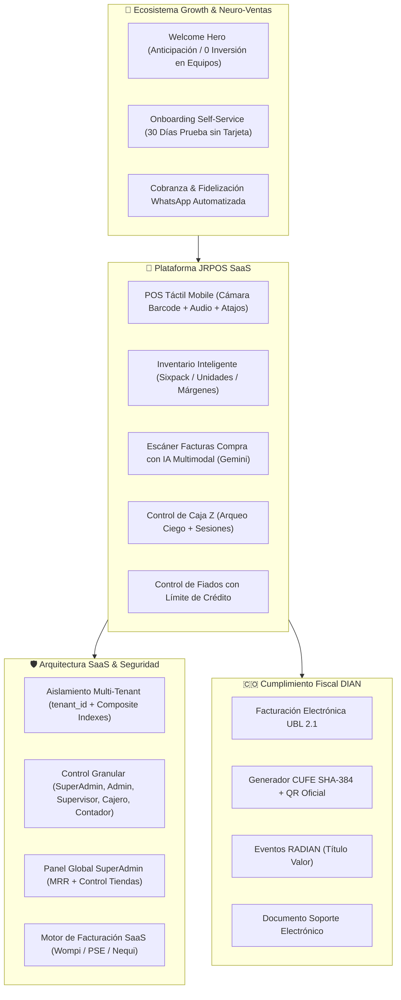
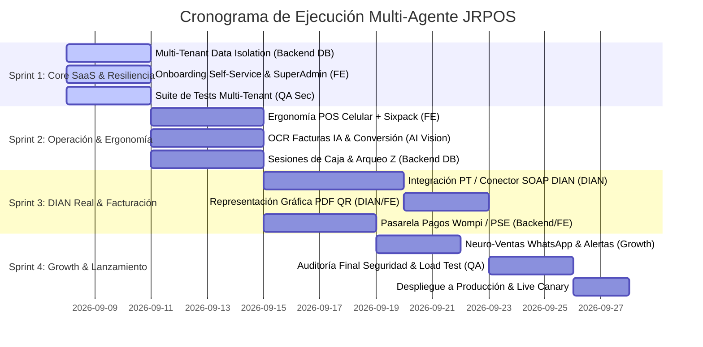

# 🌐 MASTER PLAN UNIFICADO: Orquestación y Ejecución Multi-Agente para JRPOS

> **Estado**: 🟢 *Documento Maestro Unificado — Listo para Coordinación de Agentes Especializados*  
> **Versión**: 1.0 Unificada (Consolidación de Arquitectura, SaaS Multi-Tenant, DIAN, Neuro-Ventas, Roadmap y QA)  
> **Fecha**: Septiembre 2026  
> **Propósito**: Servir como la única fuente de verdad (Single Source of Truth) para sincronizar y despachar agentes autónomos especializados (Frontend, Backend/DB, DIAN/Fiscal, IA/OCR, QA/Seguridad, Growth/Neuro-Ventas) sin solapamiento ni fricciones.

---

## 1. Visión Holística Unificada del Producto

JRPOS es una plataforma SaaS de punto de venta (POS) y gestión comercial **mobile-first, multi-tenant y offline-first**, diseñada específicamente para el ecosistema de comercio minorista en Colombia y Latinoamérica (tiendas de barrio, minimercados, droguerías, licoreras, ferreterías y cafeterías).



---

## 2. Matriz de Agentes Especializados y Asignación de Roles

Para maximizar la velocidad de desarrollo y evitar iteraciones redundantes, el trabajo se divide en **6 Agentes Especializados**, cada uno con un conjunto delimitado de responsabilidades, archivos de trabajo y skills requeridos:

```
┌───────────────────────────────────────────────────────────────────────────────────┐
│                        MASTER ORCHESTRATOR / ARCHITECT AGENT                      │
└───────┬──────────────┬──────────────┬──────────────┬──────────────┬───────────────┘
        │              │              │              │              │
┌───────▼──────┐┌──────▼──────┐┌──────▼──────┐┌──────▼──────┐┌──────▼──────┐┌────────▼──────┐
│  FRONTEND &  ││  BACKEND &  ││   DIAN &    ││  AI VISION  ││   QA &      ││   GROWTH &   │
│ MOBILE AGENT ││  DB AGENT   ││FISCAL AGENT ││  OCR AGENT  ││SECURITY AGT ││ NEURO-VENTAS │
└──────────────┘└─────────────┘└─────────────┘└─────────────┘└─────────────┘└──────────────┘
```

---

### 🤖 Agente 1: Frontend & Mobile-First Specialist (`frontend-agent`)

* **Misión**: Optimizar la experiencia táctil en celulares y tablets (cero inversión en hardware para el tendero), refinar la interfaz de los 28 módulos y componentes SaaS.
* **Archivos Clave**:
  - `frontend/src/pages/POS.jsx` (Ergonomía táctil, cámara barcode, atajos de teclado F2/F4/F9, audio Web Audio API).
  - `frontend/src/pages/RegisterTenant.jsx` y `frontend/src/pages/SuperAdmin.jsx`.
  - `frontend/src/components/Layout.jsx` (Trial countdown badge, offline sync banner, role-based nav).
  - `frontend/src/lib/offlineSync.js` (IndexedDB sync y cola de ventas offline).
* **Skills Asignados**:
  - `premium-frontend-ui`, `design-taste-frontend`, `react-performance`, `fixing-motion-performance`, `a11y-debugging`.
* **Entregables / Definition of Done (DoD)**:
  - [ ] POS operable al 100% con cámara de celular y respuesta de escaneo < 200ms.
  - [ ] Layout responsivo sin saltos visuales ni overflow en resoluciones 360px a 4K.
  - [ ] Cero errores en `craco build` y consola de navegador limpia de warnings.

---

### 🤖 Agente 2: Backend SaaS & Database Architect (`backend-db-agent`)

* **Misión**: Asegurar el aislamiento estricto por `tenant_id` en todas las consultas y endpoints, optimización de queries SQL, gestión de suscripciones y panel SuperAdmin.
* **Archivos Clave**:
  - `backend/models_sql.py` (Definición de modelos, constraints de roles e índices compuestos).
  - `backend/db_migrations.py` (Migraciones automáticas, siembra de planes y backfill retrocompatible).
  - `backend/auth.py` (JWT claims con `tenant_id` y `role`, brute-force lockout, self-service register).
  - `backend/routers/billing.py` y `backend/routers/superadmin.py`.
  - `backend/routers/*.py` (Filtrado estricto por `tenant_id` en todos los endpoints operacionales).
* **Skills Asignados**:
  - `clean-architecture`, `postgres-patterns`, `sql-optimization`, `backend-development`, `ddia-systems`.
* **Entregables / Definition of Done (DoD)**:
  - [ ] Todas las consultas operativas indexadas por `(tenant_id, ...)`.
  - [ ] Imposibilidad física de fuga de datos entre tiendas en pruebas de concurrencia.
  - [ ] Migración sin caídas ni pérdida de datos sobre la base de datos de producción.

---

### 🤖 Agente 3: Fiscal / DIAN & Compliance Specialist (`dian-agent`)

* **Misión**: Elevar el módulo de facturación electrónica desde la simulación actual hacia el conector real de Proveedor Tecnológico (PT) con firma digital XAdES-BES y validación previa DIAN.
* **Archivos Clave**:
  - `backend/dian_client.py` (Generación de XML UBL 2.1, CUFE SHA-384, código QR bidimensional).
  - `backend/routers/electronic.py`, `backend/routers/radian.py`.
  - `frontend/src/pages/Dian.jsx`, `frontend/src/pages/ElectronicPOS.jsx`.
  - `backend/models_sql.py` (`SettingsElectronic`, `SettingsCertificate`, `CreditNote`, `SupportDoc`).
* **Skills Asignados**:
  - `api-design`, `contract-first`, `security-and-hardening`, `error-handling`.
* **Entregables / Definition of Done (DoD)**:
  - [ ] XML UBL 2.1 conforme al anexo técnico 1.9 de la DIAN.
  - [ ] Representación gráfica oficial en PDF con código QR y consulta en catálogo público.
  - [ ] Soporte para eventos RADIAN (Acuse de recibo, Recibo de bienes, Aceptación expresa).

---

### 🤖 Agente 4: AI Vision & Multimodal OCR Specialist (`ai-vision-agent`)

* **Misión**: Perfeccionar el motor de extracción de facturas de proveedores mediante IA (Gemini 1.5 Flash / Groq / Vision API), soportando costos por sixpack/paquete vs unidad y auto-llenado de catálogo.
* **Archivos Clave**:
  - `backend/routers/invoices.py` (Pipeline de parsing visual, prompting multimodal y normalización JSON).
  - `frontend/src/pages/InvoiceScanner.jsx` (Visor de factura, comparación de precios y carga a inventario).
  - `backend/pricing.py` (Lógica de conversión paquete/sixpack a unidad y márgenes de ganancia).
* **Skills Asignados**:
  - `gemini-api`, `ai-multimodal`, `systematic-debugging`.
* **Entregables / Definition of Done (DoD)**:
  - [ ] Precisión > 95% en lectura de facturas físicas con arrugas o baja iluminación.
  - [ ] Detección automática de impuestos (IVA 0%, 5%, 19%, Impoconsumo) y unidades por paquete.
  - [ ] Carga masiva con un clic desde la vista previa visual.

---

### 🤖 Agente 5: Quality Engineering & Security Auditor (`qa-sec-agent`)

* **Misión**: Blindar la plataforma con una suite completa de pruebas unitarias, de integración, de penetración y verificación continua (Zero-Defect Policy).
* **Archivos Clave**:
  - `backend/tests/` (`test_saas_multitenant.py`, `test_auth_permissions.py`, `test_jrpos_modules.py`, etc.).
  - `tests/` (Suites de integración y pruebas E2E con Playwright).
  - Políticas de seguridad (CORS, Rate Limiting, prevención de inyección SQL y XSS).
* **Skills Asignados**:
  - `agentic-quality-engineering`, `qe-debug-loop`, `owasp-security`, `verification-before-completion`, `harness`.
* **Entregables / Definition of Done (DoD)**:
  - [ ] 100% de tests pasando en backend (`pytest`) y frontend (`craco test` / `vitest`).
  - [ ] Verificación de control de acceso: los cajeros reciben `403 Forbidden` en rutas protegidas.
  - [ ] Auditoría OWASP Top 10 aprobada sin vulnerabilidades críticas ni altas.

---

### 🤖 Agente 6: Growth, Neuro-Ventas & Onboarding Specialist (`growth-agent`)

* **Misión**: Implementar la psicología de Neuro-Ventas en todos los puntos de contacto para activar los 4 centros de decisión cerebral (Recompensa, Urgencia, ROI, Confianza) y maximizar la conversión a planes pagos.
* **Archivos Clave**:
  - `docs/PROPUESTA-NEURO-VENTAS.md` (Catálogo de copys, disparadores y secuencias de email).
  - `frontend/src/components/WelcomeHero.jsx` (Mensajes de contraste "Antes vs Después" y prueba social).
  - `frontend/src/pages/Credits.jsx` (Plantillas de cobro persuasivo por WhatsApp con un clic).
  - `frontend/src/pages/RegisterTenant.jsx` (Onboarding en 2 minutos sin fricción ni tarjeta).
* **Skills Asignados**:
  - `neuro-persuasion-toolkit`, `storybrand-messaging`, `cro-methodology`, `conversion-tools-automation`.
* **Entregables / Definition of Done (DoD)**:
  - [ ] Onboarding completable en menos de 120 segundos en celular.
  - [ ] Plantillas de recordatorio por WhatsApp con enlaces directos de cobro PSE/Nequi.
  - [ ] Secuencia automatizada de notificaciones para los días 23, 27, 29 y 30 del trial.

---

## 3. Plan de Ejecución por Fases en Paralelo (Sprints)



---

## 4. Protocolo de Hand-Off y Comunicación entre Agentes

Para garantizar que un agente pueda continuar o complementar el trabajo de otro sin fricciones, se establecen los siguientes contratos de interfaz:

1. **Contrato de Autenticación & Tenancy**:
   - Todo request HTTP autenticado debe portar cookie `access_token` o header `Authorization: Bearer <JWT>`.
   - El payload del JWT incluye `{ sub: user_id, email, role, tenant_id }`.
   - Cualquier agente que cree nuevos endpoints DEBE inyectar `user: User = Depends(get_current_user)` y filtrar consultas con `Model.tenant_id == user.tenant_id`.

2. **Contrato de UI & Design System**:
   - Tema oscuro premium (`#07100c` background, bordes `white/10`, acentos esmeralda/teal).
   - Componentes construidos con Radix UI primitives, Lucide React icons y Tailwind CSS.
   - Todas las páginas deben implementar `data-testid` en botones, formularios y tablas para facilitar pruebas automatizadas de QA.

3. **Contrato de Calidad y Pull Requests**:
   - Antes de considerar una tarea como completada, el agente debe ejecutar:
     ```bash
     # Backend Verification
     cd backend && python -m pytest
     
     # Frontend Build Verification
     cd frontend && npx craco build
     ```
   - No se permite fusionar código con warnings de ESLint no suprimidos ni pruebas unitarias en estado `FAILED`.

---

## 5. Próximos Pasos para Despachar Agentes

1. **Paso Inmediato**: Asignar tareas específicas del Sprint a los subagentes correspondientes utilizando este documento como contexto base.
2. **Monitoreo**: Validar los entregables de cada agente contra la tabla de **Definition of Done (DoD)** de la Sección 2.
3. **Sincronización Git**: Cada agente confirma sus avances con mensajes de commit estructurados siguiendo la convención Conventional Commits (`feat(modulo): ...`, `fix(auth): ...`, `test(saas): ...`).
