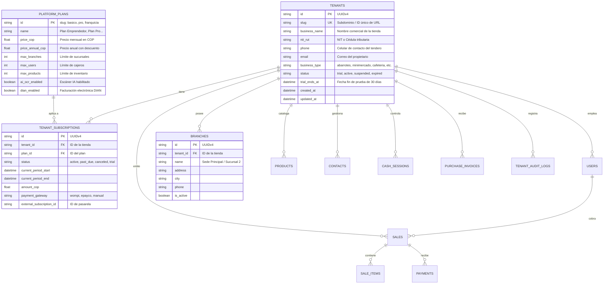

# 📐 Plan Maestro: Arquitectura SaaS Multi-Tenant, Esquema de Base de Datos y Sistema de Roles para JRPOS

> **Estado**: 🟡 *Propuesta Técnica y Estructura de Base de Datos Preparada — Pendiente de Confirmación del Usuario*  
> **Objetivo**: Transformar JRPOS en una plataforma SaaS lista para producción con aislamiento multi-inquilino (Multi-Tenant), control de acceso granular basado en roles (RBAC), gestión de suscripciones con prueba gratuita de 30 días, panel SuperAdmin de plataforma y esquema de base de datos detallado.  
> **Fecha**: Septiembre 2026

---

## 1. Visión General del Modelo de Negocio y Arquitectura

### 1.1. Estrategia de Tenancy (Aislamiento de Datos)
Se implementa el patrón **Shared Database, Shared Schema con Discriminador de Inquilino (`tenant_id`)** indexado y blindado por middleware:
- **Eficiencia en Costos**: Permite soportar miles de pequeños comercios (tiendas de barrio, minimercados, cafeterías) en una única infraestructura optimizada sin costos de mantenimiento por base de datos individual.
- **Aislamiento Seguro (Defense-in-Depth)**:
  1. *Capa de Entrada (Middleware/JWT)*: Inyección del `tenant_id` desde el token criptográfico firmado.
  2. *Capa de Servicio/Rutas*: Inyección obligatoria de dependencias `CurrentTenant` en FastAPI.
  3. *Capa ORM/Base de Datos*: `BaseTenantModel` con `tenant_id` indexado compuesto en todas las consultas y claves foráneas.

### 1.2. Modelo Comercial y Ciclo de Vida del Inquilino (30 Días de Prueba)
- **Registro Self-Service (0 Fricción)**: El tendero se registra con Nombre, Correo, Celular y Nombre de Tienda sin requerir tarjeta de crédito.
- **Período de Prueba de 30 Días**:
  - `trial_ends_at = utcnow() + timedelta(days=30)`
  - Acceso completo a todos los módulos operativos (POS, Inventario, Fiados, Escaneo IA, Reportes).
  - Contador visual no intrusivo en la cabecera: *"Te quedan X días de prueba gratuita"*.
- **Alertas Automatizadas**: Notificaciones en días 23 (7 días restantes), 27 (3 días restantes), 29 (1 día restante) y día 30 (Vencimiento).
- **Período de Gracia (3 días)**: Acceso de solo lectura / backup antes de suspender la emisión de nuevas ventas.

---

## 2. Jerarquía de Roles y Matriz de Permisos (RBAC)

```
                       ┌───────────────────────────────┐
                       │     SUPERADMIN PLATAFORMA     │ (Dueño de JRPOS SaaS)
                       │  - Métricas MRR / Churn       │
                       │  - Gestión global de Tenants  │
                       │  - Soporte y auditoría        │
                       └───────────────┬───────────────┘
                                       │
                ┌──────────────────────┴──────────────────────┐
                │             TENANT / COMERCIO               │
                │  (Ej: Minimercado El Triunfo - tenant_id)   │
                └──────────────────────┬──────────────────────┘
                                       │
        ┌──────────────────────────────┼──────────────────────────────┐
        │                              │                              │
┌───────▼────────┐             ┌───────▼────────┐             ┌───────▼────────┐
│  OWNER / ADMIN │             │  SUPERVISOR    │             │    CAJERO      │
│ (Dueño Tienda) │             │ (Encargado)    │             │  (Vendedor)    │
└───────┬────────┘             └───────┬────────┘             └───────┬────────┘
        │                              │                              │
        ▼                              ▼                              ▼
Control total tienda,         Inventario, compras,           POS Venta, escáner,
reportes de margen,           arqueos, mermas,               cobros, abonos fiados,
usuarios y suscripción.       ajuste de stock.               cierre de su turno.
```

### 2.1. Definición de Roles

| Rol | Alcance | Capacidades Principales |
| :--- | :--- | :--- |
| **`superadmin_platform`** | Global (Todos los tenants) | Ver estadísticas de la plataforma, suspender/activar tiendas, gestionar planes de suscripción, suplantación segura de soporte (*impersonation*). |
| **`tenant_owner` / `admin`** | Tenant específico | Configuración general, gestión de usuarios/cajeros, reportes de utilidades y márgenes, exportación contable, facturación DIAN, pagos de suscripción. |
| **`manager` / `supervisor`** | Tenant específico | Carga de compras, recepción de facturas IA, ajustes de inventario, consulta de ventas generales, gestión de clientes y proveedores. |
| **`cajero` / `cashier`** | Tenant específico | Terminal POS, escáner de cámara/código de barras, cobro en múltiples medios de pago, registro de clientes, abonos de créditos/fiados, arqueo de su propia caja. |
| **`auditor` / `contador`** | Tenant específico (Solo lectura) | Consulta de libros de ventas, compras, cuentas de cobro, notas crédito/débito y descarga de reportes contables (Excel / CSV). |

### 2.2. Matriz de Permisos Granulares

| Permiso Clave | `admin` | `supervisor` | `cajero` | `contador` |
| :--- | :---: | :---: | :---: | :---: |
| `pos:sell` (Vender en POS) | ✅ | ✅ | ✅ | ❌ |
| `pos:discount` (Aplicar descuento manual) | ✅ | ✅ | ⚠️ (Con límite) | ❌ |
| `pos:hold_resume` (Retener cuentas) | ✅ | ✅ | ✅ | ❌ |
| `inventory:view` (Ver stock) | ✅ | ✅ | ✅ | ✅ |
| `inventory:edit_cost_price` (Editar costos y precios) | ✅ | ✅ | ❌ | ❌ |
| `inventory:stock_adjust` (Ajustes de merma/pérdida) | ✅ | ✅ | ❌ | ❌ |
| `invoices:ocr_scan` (Escanear facturas con IA) | ✅ | ✅ | ❌ | ❌ |
| `credits:collect` (Recibir abonos de fiados) | ✅ | ✅ | ✅ | ❌ |
| `cash:close_z` (Cierre general de caja Z) | ✅ | ✅ | ❌ | ❌ |
| `reports:view_margins` (Ver ganancia neta / márgenes) | ✅ | ❌ | ❌ | ✅ |
| `users:manage` (Crear / eliminar usuarios) | ✅ | ❌ | ❌ | ❌ |
| `billing:manage` (Pagar suscripción SaaS) | ✅ | ❌ | ❌ | ❌ |

---

## 3. Estructura Exhaustiva de la Base de Datos (Multi-Tenant Schema)

### 3.1. Diagrama Entidad-Relación Global



---

### 3.2. DDL SQL Completo para Nuevas Tablas de Plataforma

```sql
-- 1. TABLA DE TIENDAS / INQUILINOS (TENANTS)
CREATE TABLE IF NOT EXISTS tenants (
    id VARCHAR(36) PRIMARY KEY,
    slug VARCHAR(100) NOT NULL UNIQUE,
    business_name VARCHAR(255) NOT NULL,
    nit_rut VARCHAR(50),
    phone VARCHAR(50),
    email VARCHAR(255) NOT NULL,
    business_type VARCHAR(50) DEFAULT 'abarrotes',
    status VARCHAR(20) NOT NULL DEFAULT 'trial',
    trial_ends_at TIMESTAMP WITH TIME ZONE NOT NULL,
    created_at TIMESTAMP WITH TIME ZONE DEFAULT CURRENT_TIMESTAMP,
    updated_at TIMESTAMP WITH TIME ZONE DEFAULT CURRENT_TIMESTAMP,
    CONSTRAINT ck_tenant_status CHECK (status IN ('trial', 'active', 'suspended', 'expired'))
);
CREATE INDEX IF NOT EXISTS ix_tenants_status ON tenants(status);
CREATE INDEX IF NOT EXISTS ix_tenants_email ON tenants(email);

-- 2. TABLA DE PLANES DE LA PLATAFORMA SAAS
CREATE TABLE IF NOT EXISTS platform_plans (
    id VARCHAR(50) PRIMARY KEY,
    name VARCHAR(100) NOT NULL,
    description TEXT,
    price_cop FLOAT NOT NULL DEFAULT 0.0,
    price_annual_cop FLOAT NOT NULL DEFAULT 0.0,
    max_branches INT NOT NULL DEFAULT 1,
    max_users INT NOT NULL DEFAULT 3,
    max_products INT NOT NULL DEFAULT 5000,
    ai_ocr_enabled BOOLEAN NOT NULL DEFAULT TRUE,
    dian_enabled BOOLEAN NOT NULL DEFAULT FALSE,
    is_active BOOLEAN NOT NULL DEFAULT TRUE,
    created_at TIMESTAMP WITH TIME ZONE DEFAULT CURRENT_TIMESTAMP
);

-- 3. TABLA DE SUSCRIPCIONES DE TIENDAS
CREATE TABLE IF NOT EXISTS tenant_subscriptions (
    id VARCHAR(36) PRIMARY KEY,
    tenant_id VARCHAR(36) NOT NULL REFERENCES tenants(id) ON DELETE CASCADE,
    plan_id VARCHAR(50) NOT NULL REFERENCES platform_plans(id),
    status VARCHAR(20) NOT NULL DEFAULT 'trial',
    current_period_start TIMESTAMP WITH TIME ZONE DEFAULT CURRENT_TIMESTAMP,
    current_period_end TIMESTAMP WITH TIME ZONE NOT NULL,
    amount_cop FLOAT NOT NULL DEFAULT 0.0,
    payment_gateway VARCHAR(50) DEFAULT 'manual',
    external_subscription_id VARCHAR(255),
    created_at TIMESTAMP WITH TIME ZONE DEFAULT CURRENT_TIMESTAMP,
    updated_at TIMESTAMP WITH TIME ZONE DEFAULT CURRENT_TIMESTAMP,
    CONSTRAINT ck_subscription_status CHECK (status IN ('trial', 'active', 'past_due', 'canceled'))
);
CREATE INDEX IF NOT EXISTS ix_tenant_subscriptions_tenant ON tenant_subscriptions(tenant_id);

-- 4. TABLA DE SUCURSALES (MULTI-SEDE DENTRO DEL TENANT)
CREATE TABLE IF NOT EXISTS branches (
    id VARCHAR(36) PRIMARY KEY,
    tenant_id VARCHAR(36) NOT NULL REFERENCES tenants(id) ON DELETE CASCADE,
    name VARCHAR(255) NOT NULL,
    address VARCHAR(255),
    city VARCHAR(100),
    phone VARCHAR(50),
    is_active BOOLEAN NOT NULL DEFAULT TRUE,
    created_at TIMESTAMP WITH TIME ZONE DEFAULT CURRENT_TIMESTAMP
);
CREATE INDEX IF NOT EXISTS ix_branches_tenant ON branches(tenant_id);

-- 5. TABLA DE AUDITORÍA Y TRAZABILIDAD SAAS
CREATE TABLE IF NOT EXISTS tenant_audit_logs (
    id VARCHAR(36) PRIMARY KEY,
    tenant_id VARCHAR(36) NOT NULL,
    user_id VARCHAR(36),
    user_name VARCHAR(255),
    action VARCHAR(100) NOT NULL,
    entity_type VARCHAR(100) NOT NULL,
    entity_id VARCHAR(36),
    details TEXT,
    ip_address VARCHAR(50),
    created_at TIMESTAMP WITH TIME ZONE DEFAULT CURRENT_TIMESTAMP
);
CREATE INDEX IF NOT EXISTS ix_audit_tenant_created ON tenant_audit_logs(tenant_id, created_at);
```

---

### 3.3. Inyección de `tenant_id` e Índices Compuestos en Tablas Existentes

Todas las tablas operativas se amplían con `tenant_id VARCHAR(36)` con índices compuestos estratégicos para máxima velocidad de consulta y aislamiento absoluto:

| Tabla | Columna Añadida | Índices Compuestos de Aislamiento | Clave Foránea Lógica / Constraint |
| :--- | :--- | :--- | :--- |
| **`users`** | `tenant_id VARCHAR(36)` | `ix_users_tenant_email (tenant_id, email)` | `CheckConstraint("role IN ('superadmin_platform', 'admin', 'supervisor', 'cajero', 'contador')")` |
| **`products`** | `tenant_id VARCHAR(36)` | `ix_products_tenant_barcode (tenant_id, barcode)`, `ix_products_tenant_name (tenant_id, name)` | Los códigos de barra son únicos **por tienda** |
| **`category_meta`**| `tenant_id VARCHAR(36) NOT NULL` | `ix_catmeta_tenant_name (tenant_id, name)` | **Clave primaria compuesta `(tenant_id, name)`** — mismo nombre de categoría puede existir en cada tienda (antes PK era solo `name` y colisionaba entre tenants) |
| **`contacts`** | `tenant_id VARCHAR(36)` | `ix_contacts_tenant_doc (tenant_id, document)`, `ix_contacts_tenant_kind (tenant_id, kind)` | Clientes y proveedores aislados por tienda |
| **`sales`** | `tenant_id VARCHAR(36)` | `ix_sales_tenant_number (tenant_id, number)`, `ix_sales_tenant_created (tenant_id, created_at)` | Consecutivo de venta único **por tienda** |
| **`sale_items`** | `tenant_id VARCHAR(36)` | `ix_saleitems_tenant_sale (tenant_id, sale_id)` | Detalle de venta seguro |
| **`payments`** | `tenant_id VARCHAR(36)` | `ix_payments_tenant_sale (tenant_id, sale_id)` | Pagos y abonos a créditos |
| **`held_sales`** | `tenant_id VARCHAR(36)` | `ix_heldsales_tenant (tenant_id)` | Cuentas retenidas en POS |
| **`expenses`** | `tenant_id VARCHAR(36)` | `ix_expenses_tenant_created (tenant_id, created_at)` | Gastos de caja |
| **`purchase_invoices`**| `tenant_id VARCHAR(36)` | `ix_pinv_tenant_created (tenant_id, created_at)` | Facturas escaneadas por OCR IA |
| **`cash_sessions`**| `tenant_id VARCHAR(36)` | `ix_cashsess_tenant_user (tenant_id, user_id)` | Apertura y cierre de turnos de caja |
| **`cash_pickups`** | `tenant_id VARCHAR(36)` | `ix_pickups_tenant_session (tenant_id, cash_session_id)` | Retiros parciales de efectivo |
| **`promotions`** | `tenant_id VARCHAR(36)` | `ix_promos_tenant (tenant_id)` | Descuentos y combos |
| **`documents`** | `tenant_id VARCHAR(36)` | `ix_docs_tenant_number (tenant_id, number)` | Cotizaciones, remisiones y cuentas de cobro |
| **`credit_notes`** | `tenant_id VARCHAR(36)` | `ix_cnotes_tenant_number (tenant_id, number)` | Notas crédito y devoluciones |
| **`warranties`** | `tenant_id VARCHAR(36)` | `ix_warranties_tenant (tenant_id)` | Gestión de garantías |
| **`purchase_orders`**| `tenant_id VARCHAR(36)` | `ix_porders_tenant_number (tenant_id, number)` | Órdenes de pedido a proveedores |
| **`support_docs`** | `tenant_id VARCHAR(36)` | `ix_sdocs_tenant_number (tenant_id, number)` | Documento soporte electrónico DIAN |
| **`payroll`** | `tenant_id VARCHAR(36)` | `ix_payroll_tenant_period (tenant_id, period)` | Liquidación de nómina de empleados |
| **`commission_rules`**| `tenant_id VARCHAR(36)` | `ix_comrules_tenant (tenant_id)` | Reglas de comisiones por cajero |
| **`settings_general`**| `tenant_id VARCHAR(36)` | `ix_settings_tenant (tenant_id)` | Configuración de tienda, ticket y API OCR |
| **`settings_electronic`**| `tenant_id VARCHAR(36)` | `ix_dian_tenant (tenant_id)` | Rangos y resolución DIAN por tienda |
| **`timeclock`** | `tenant_id VARCHAR(36)` | `ix_timeclock_tenant_created (tenant_id, created_at)` | Reloj checador biométrico/PIN |

---

### 3.4. Definición de Modelos SQLAlchemy 2.0 (Drop-in Ready)

```python
# --- MODELOS SAAS PLATAFORMA ---

class Tenant(Base):
    __tablename__ = "tenants"
    __table_args__ = (
        CheckConstraint("status IN ('trial', 'active', 'suspended', 'expired')", name="ck_tenant_status"),
    )

    id: Mapped[str] = mapped_column(String(36), primary_key=True, default=new_uuid)
    slug: Mapped[str] = mapped_column(String(100), unique=True, nullable=False, index=True)
    business_name: Mapped[str] = mapped_column(String(255), nullable=False)
    nit_rut: Mapped[str | None] = mapped_column(String(50), nullable=True)
    phone: Mapped[str | None] = mapped_column(String(50), nullable=True)
    email: Mapped[str] = mapped_column(String(255), nullable=False, index=True)
    business_type: Mapped[str] = mapped_column(String(50), nullable=False, default="abarrotes")
    status: Mapped[str] = mapped_column(String(20), nullable=False, default="trial", index=True)
    trial_ends_at: Mapped[datetime] = mapped_column(DateTime(timezone=True), nullable=False)
    created_at: Mapped[datetime] = mapped_column(DateTime(timezone=True), default=utcnow)
    updated_at: Mapped[datetime] = mapped_column(DateTime(timezone=True), default=utcnow, onupdate=utcnow)


class PlatformPlan(Base):
    __tablename__ = "platform_plans"

    id: Mapped[str] = mapped_column(String(50), primary_key=True)  # basico, pro, franquicia
    name: Mapped[str] = mapped_column(String(100), nullable=False)
    description: Mapped[str | None] = mapped_column(Text, nullable=True)
    price_cop: Mapped[float] = mapped_column(Float, nullable=False, default=0.0)
    price_annual_cop: Mapped[float] = mapped_column(Float, nullable=False, default=0.0)
    max_branches: Mapped[int] = mapped_column(Integer, nullable=False, default=1)
    max_users: Mapped[int] = mapped_column(Integer, nullable=False, default=3)
    max_products: Mapped[int] = mapped_column(Integer, nullable=False, default=5000)
    ai_ocr_enabled: Mapped[bool] = mapped_column(Boolean, nullable=False, default=True)
    dian_enabled: Mapped[bool] = mapped_column(Boolean, nullable=False, default=False)
    is_active: Mapped[bool] = mapped_column(Boolean, nullable=False, default=True)
    created_at: Mapped[datetime] = mapped_column(DateTime(timezone=True), default=utcnow)


class TenantSubscription(Base):
    __tablename__ = "tenant_subscriptions"
    __table_args__ = (
        CheckConstraint("status IN ('trial', 'active', 'past_due', 'canceled')", name="ck_subscription_status"),
    )

    id: Mapped[str] = mapped_column(String(36), primary_key=True, default=new_uuid)
    tenant_id: Mapped[str] = mapped_column(String(36), nullable=False, index=True)
    plan_id: Mapped[str] = mapped_column(String(50), nullable=False)
    status: Mapped[str] = mapped_column(String(20), nullable=False, default="trial")
    current_period_start: Mapped[datetime] = mapped_column(DateTime(timezone=True), default=utcnow)
    current_period_end: Mapped[datetime] = mapped_column(DateTime(timezone=True), nullable=False)
    amount_cop: Mapped[float] = mapped_column(Float, nullable=False, default=0.0)
    payment_gateway: Mapped[str | None] = mapped_column(String(50), nullable=True, default="manual")
    external_subscription_id: Mapped[str | None] = mapped_column(String(255), nullable=True)
    created_at: Mapped[datetime] = mapped_column(DateTime(timezone=True), default=utcnow)
    updated_at: Mapped[datetime] = mapped_column(DateTime(timezone=True), default=utcnow, onupdate=utcnow)


class Branch(Base):
    __tablename__ = "branches"

    id: Mapped[str] = mapped_column(String(36), primary_key=True, default=new_uuid)
    tenant_id: Mapped[str] = mapped_column(String(36), nullable=False, index=True)
    name: Mapped[str] = mapped_column(String(255), nullable=False)
    address: Mapped[str | None] = mapped_column(String(255), nullable=True)
    city: Mapped[str | None] = mapped_column(String(100), nullable=True)
    phone: Mapped[str | None] = mapped_column(String(50), nullable=True)
    is_active: Mapped[bool] = mapped_column(Boolean, nullable=False, default=True)
    created_at: Mapped[datetime] = mapped_column(DateTime(timezone=True), default=utcnow)
```

---

### 3.5. Estrategia de Migración Retrocompatible y Cero Pérdida de Datos

El script de migración en `backend/db_migrations.py` ejecutará de forma atómica:
1. **Creación de tablas SaaS**: `tenants`, `platform_plans`, `tenant_subscriptions`, `branches`, `tenant_audit_logs`.
2. **Adición segura de columnas**: `ALTER TABLE {table} ADD COLUMN IF NOT EXISTS tenant_id VARCHAR(36);`
3. **Siembra del Tenant por Defecto**:
   - `id = 'tenant-default-001'`
   - `slug = 'tienda-principal'`
   - `business_name = 'Tienda Principal'`
   - `status = 'active'` (o `trial` con 30 días)
4. **Migración de Datos Existentes**:
   - `UPDATE {table} SET tenant_id = 'tenant-default-001' WHERE tenant_id IS NULL;`
5. **Creación de Índices Compuestos** para acelerar todas las consultas filtradas por `tenant_id`.

---

## 4. Arquitectura de Backend (FastAPI + SQLAlchemy)

### 4.1. Inyección de Contexto de Inquilino (Tenant Context Middleware)

```python
tenant_context: ContextVar[str] = ContextVar("tenant_context", default="")

class TenantMiddleware(BaseHTTPMiddleware):
    async def dispatch(self, request: Request, call_next):
        # Extrae tenant del JWT validado criptográficamente o header X-Tenant-ID
        tenant_id = extract_tenant(request)
        token = tenant_context.set(tenant_id)
        try:
            response = await call_next(request)
            return response
        finally:
            tenant_context.reset(token)
```

### 4.2. Dependencias de Seguridad y Verificación de Permisos

```python
async def get_current_tenant(user: User = Depends(get_current_user)) -> Tenant:
    if user.role == "superadmin_platform":
        return None # Acceso global
    if not user.tenant_id:
        raise HTTPException(status_code=403, detail="Usuario sin tenant asignado")
    tenant = await get_tenant_by_id(user.tenant_id)
    if tenant.status == "suspended":
        raise HTTPException(status_code=402, detail="Suscripción suspendida. Contacte a soporte o renueve su plan.")
    return tenant

def require_permission(permission: str):
    async def dependency(user: User = Depends(get_current_user)):
        if user.role == "superadmin_platform":
            return user
        if permission not in ROLE_PERMISSIONS.get(user.role, []):
            raise HTTPException(
                status_code=403, 
                detail=f"Permiso denegado: requiere '{permission}'"
            )
        return user
    return dependency
```

---

## 5. Arquitectura de Frontend (React + React Router)

### 5.1. Proveedor de Contexto SaaS (`TenantContext` & `Can` Gate)
- **`TenantProvider`**: Carga datos de la suscripción, días restantes de prueba y límites del plan.
- **Componente `<Can permission="inventory:edit_cost_price">`**: Oculta o deshabilita botones según el rol del usuario activo.
- **Banner de Trial Reactivo**: Barra superior visible durante la prueba gratuita de 30 días:
  - *"Prueba Gratuita JRPOS: Te quedan 24 días. [Activar Plan Pro]"*

### 5.2. Enrutamiento y Módulos Protegidos
- Si el tenant expira, las rutas redirigen a `/suscripcion` con opciones de pago local (Wompi PSE / Nequi / Tarjeta) y botón de respaldo de datos en Excel.

---

## 6. Panel de SuperAdmin SaaS (`/superadmin`)

Módulo exclusivo para el dueño de JRPOS:
1. **Métricas en Tiempo Real**:
   - Total de tiendas registradas / Tiendas en Trial / Suscripciones activas.
   - Ingreso Recurrente Mensual (MRR) en COP.
   - Volumen de ventas procesadas en toda la red de tiendas.
2. **Gestión de Tiendas**:
   - Buscador de tiendas por NIT, nombre, teléfono o correo.
   - Botón de extensión de prueba (+15 días, +30 días para fidelización).
   - Cambio manual de planes y estado (Activo, Trial, Suspendido).
   - Acceso de Soporte asistido (*Login como administrador de la tienda* para resolver incidencias).

---

## 7. Plan de Implementación Paso a Paso (Para Ejecutar Tras Aprobación)

### 🔹 Fase 1: Capa de Base de Datos y Modelos Multi-Tenant
1. Definir modelos `Tenant`, `TenantSubscription`, `PlatformPlan`, `Branch`, `TenantAuditLog` en `models_sql.py`.
2. Actualizar constraint de roles en `User` para incluir `superadmin_platform`, `admin`, `supervisor`, `cajero`, `contador`.
3. Agregar `tenant_id` en todas las tablas operativas con script de migración retrocompatible en `db_migrations.py`.

### 🔹 Fase 2: Backend Core, Middleware y Roles
1. Crear `TenantMiddleware` y decoradores `@require_permission(...)`.
2. Actualizar `/api/auth/register-tenant` y `/api/auth/login` para emitir tokens JWT con `tenant_id` y `permissions`.
3. Validar estado del tenant (activo, trial, expirado) en cada petición.

### 🔹 Fase 3: Lógica de Negocio de 30 Días de Prueba y Pagos
1. Endpoints de facturación: `/api/billing/status`, `/api/billing/plans`, `/api/billing/checkout`.
2. Integración de webhook para pasarelas de pago colombianas (Wompi / PSE / Nequi).

### 🔹 Fase 4: Frontend Multi-Tenant y Componentes de Roles
1. Implementar `TenantContext` y guards de rutas (`RoleRoute`, `SubscriptionGuard`).
2. Diseñar la pantalla de Registro de Nueva Tienda (`/registro`).
3. Barra de cuenta regresiva de prueba gratuita (30 días).

### 🔹 Fase 5: Panel de SuperAdmin Global
1. Crear router `/api/superadmin/*` protegido exclusivamente para `superadmin_platform`.
2. Desarrollar la vista `/superadmin` con KPIs de la plataforma SaaS y tabla de control de tiendas.

### 🔹 Fase 6: Pruebas Automatizadas y Verificación End-to-End
1. Pruebas de aislamiento: verificar que el *Tenant A* jamás pueda leer ni modificar productos o ventas del *Tenant B*.
2. Pruebas de roles: verificar que un `cajero` reciba `403 Forbidden` al intentar acceder a márgenes, usuarios o configuración.
3. Pruebas de expiración de trial y paso a producción.

---

## 8. Confirmación Requerida

> [!IMPORTANT]
> Este documento contiene la arquitectura técnica completa y el diseño exhaustivo de la base de datos.  
> **No se ha ejecutado ninguna modificación en el código fuente.**  
> Para iniciar la implementación de las fases descritas, por favor confirma tu aprobación.
