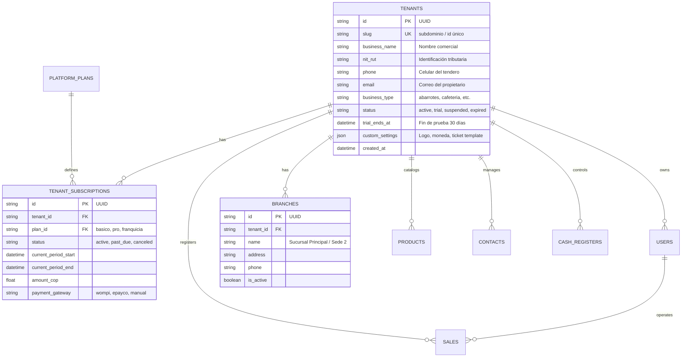

# 📐 Plan Maestro: Arquitectura SaaS Multi-Tenant y Sistema de Roles para JRPOS

> **Estado**: 🟡 *Propuesta Técnica Preparada — Pendiente de Aprobación por el Usuario*  
> **Objetivo**: Transformar JRPOS en una plataforma SaaS lista para producción con aislamiento multi-inquilino (Multi-Tenant), control de acceso granular basado en roles (RBAC), gestión de suscripciones con prueba gratuita de 30 días y panel SuperAdmin de plataforma.  
> **Fecha**: Septiembre 2026

---

## 1. Visión General del Modelo de Negocio y Arquitectura

### 1.1. Estrategia de Tenancy (Aislamiento de Datos)
Se implementa el patrón **Shared Database, Shared Schema con Discriminador de Inquilino (`tenant_id`)** indexado y blindado por middleware:
- **Eficiencia en Costos**: Permite soportar miles de pequeños comercios (tiendas de barrio, minimercados, cafeterías) en una única infraestructura optimizada sin costos de mantenimiento por base de datos individual.
- **Aislamiento Seguro (Defense-in-Depth)**:
  1. *Capa de Entrada (Middleware/JWT)*: Inyección del `tenant_id` desde el token criptográfico firmado.
  2. *Capa de Servicio/Rutas*: Inyección obligatoria de dependencias `CurrentTenant` en FastAPI.
  3. *Capa ORM/Base de Datos*: `BaseTenantModel` con `tenant_id` indexado compuesto en todas las consultas y claves foráneas.

### 1.2. Modelo Comercial y Ciclo de Vida del Inquilino (30 Días de Prueba)
- **Registro Self-Service (0 Fricción)**: El tendero se registra con Nombre, Correo, Celular y Nombre de Tienda sin requerir tarjeta de crédito.
- **Período de Prueba de 30 Días**:
  - `trial_ends_at = utcnow() + timedelta(days=30)`
  - Acceso completo a todos los módulos operativos (POS, Inventario, Fiados, Escaneo IA, Reportes).
  - Contador visual no intrusivo en la cabecera: *"Te quedan X días de prueba gratuita"*.
- **Alertas Automatizadas**: Notificaciones en días 23 (7 días restantes), 27 (3 días restantes), 29 (1 día restante) y día 30 (Vencimiento).
- **Período de Gracia (3 días)**: Acceso de solo lectura / backup antes de suspender la emisión de nuevas ventas.

---

## 2. Jerarquía de Roles y Matriz de Permisos (RBAC)

```
                       ┌───────────────────────────────┐
                       │     SUPERADMIN PLATAFORMA     │ (Dueño de JRPOS SaaS)
                       │  - Métricas MRR / Churn       │
                       │  - Gestión global de Tenants  │
                       │  - Soporte y auditoría        │
                       └───────────────┬───────────────┘
                                       │
                ┌──────────────────────┴──────────────────────┐
                │             TENANT / COMERCIO               │
                │  (Ej: Minimercado El Triunfo - tenant_id)   │
                └──────────────────────┬──────────────────────┘
                                       │
        ┌──────────────────────────────┼──────────────────────────────┐
        │                              │                              │
┌───────▼────────┐             ┌───────▼────────┐             ┌───────▼────────┐
│  OWNER / ADMIN │             │  SUPERVISOR    │             │    CAJERO      │
│ (Dueño Tienda) │             │ (Encargado)    │             │  (Vendedor)    │
└───────┬────────┘             └───────┬────────┘             └───────┬────────┘
        │                              │                              │
        ▼                              ▼                              ▼
Control total tienda,         Inventario, compras,           POS Venta, escáner,
reportes de margen,           arqueos, mermas,               cobros, abonos fiados,
usuarios y suscripción.       ajuste de stock.               cierre de su turno.
```

### 2.1. Definición de Roles

| Rol | Alcance | Capacidades Principales |
| :--- | :--- | :--- |
| **`superadmin_platform`** | Global (Todos los tenants) | Ver estadísticas de la plataforma, suspender/activar tiendas, gestionar planes de suscripción, suplantación segura de soporte (*impersonation*). |
| **`tenant_owner` / `admin`** | Tenant específico | Configuración general, gestión de usuarios/cajeros, reportes de utilidades y márgenes, exportación contable, facturación DIAN, pagos de suscripción. |
| **`manager` / `supervisor`** | Tenant específico | Carga de compras, recepción de facturas IA, ajustes de inventario, consulta de ventas generales, gestión de clientes y proveedores. |
| **`cajero` / `cashier`** | Tenant específico | Terminal POS, escáner de cámara/código de barras, cobro en múltiples medios de pago, registro de clientes, abonos de créditos/fiados, arqueo de su propia caja. |
| **`auditor` / `contador`** | Tenant específico (Solo lectura) | Consulta de libros de ventas, compras, cuentas de cobro, notas crédito/débito y descarga de reportes contables (Excel / CSV). |

### 2.2. Matriz de Permisos Granulares

| Permiso Clave | `admin` | `supervisor` | `cajero` | `contador` |
| :--- | :---: | :---: | :---: | :---: |
| `pos:sell` (Vender en POS) | ✅ | ✅ | ✅ | ❌ |
| `pos:discount` (Aplicar descuento manual) | ✅ | ✅ | ⚠️ (Con límite) | ❌ |
| `pos:hold_resume` (Retener cuentas) | ✅ | ✅ | ✅ | ❌ |
| `inventory:view` (Ver stock) | ✅ | ✅ | ✅ | ✅ |
| `inventory:edit_cost_price` (Editar costos y precios) | ✅ | ✅ | ❌ | ❌ |
| `inventory:stock_adjust` (Ajustes de merma/pérdida) | ✅ | ✅ | ❌ | ❌ |
| `invoices:ocr_scan` (Escanear facturas con IA) | ✅ | ✅ | ❌ | ❌ |
| `credits:collect` (Recibir abonos de fiados) | ✅ | ✅ | ✅ | ❌ |
| `cash:close_z` (Cierre general de caja Z) | ✅ | ✅ | ❌ | ❌ |
| `reports:view_margins` (Ver ganancia neta / márgenes) | ✅ | ❌ | ❌ | ✅ |
| `users:manage` (Crear / eliminar usuarios) | ✅ | ❌ | ❌ | ❌ |
| `billing:manage` (Pagar suscripción SaaS) | ✅ | ❌ | ❌ | ❌ |

---

## 3. Modelo de Datos y Esquema de Base de Datos

### 3.1. Nuevas Tablas del Ecosistema Multi-Tenant



### 3.2. Adaptación de Tablas Existentes (`tenant_id`)
Todas las tablas existentes reciben la columna obligatoria `tenant_id` con índice compuesto:
- `products`: `(tenant_id, barcode)`, `(tenant_id, name)`
- `sales`: `(tenant_id, number)`, `(tenant_id, created_at)`
- `contacts`: `(tenant_id, document)`, `(tenant_id, kind)`
- `cash_registers` & `cash_movements`: `(tenant_id, user_id)`
- `settings`: Clave compuesta `(tenant_id, key)`

---

## 4. Arquitectura de Backend (FastAPI + SQLAlchemy)

### 4.1. Inyección de Contexto de Inquilino (Tenant Context Middleware)

```python
# ContextVar para propagación segura de tenant en peticiones asíncronas
tenant_context: ContextVar[str] = ContextVar("tenant_context", default="")

class TenantMiddleware(BaseHTTPMiddleware):
    async def dispatch(self, request: Request, call_next):
        # 1. Extraer tenant de JWT (si la ruta está autenticada)
        # 2. O extraer de subdominio (ej: mitienda.jrpos.co)
        # 3. O header X-Tenant-ID (para integraciones móviles/API)
        tenant_id = extract_tenant(request)
        token = tenant_context.set(tenant_id)
        try:
            response = await call_next(request)
            return response
        finally:
            tenant_context.reset(token)
```

### 4.2. Dependencias de Seguridad y Verificación de Permisos

```python
async def get_current_tenant(user: User = Depends(get_current_user)) -> Tenant:
    if not user.tenant_id:
        raise HTTPException(status_code=403, detail="Usuario sin tenant asignado")
    tenant = await get_tenant_by_id(user.tenant_id)
    if tenant.status == "suspended":
        raise HTTPException(status_code=402, detail="Cuenta suspendida por suscripción")
    return tenant

def require_permission(permission: str):
    async def dependency(user: User = Depends(get_current_user)):
        if user.role == "superadmin_platform":
            return user
        if permission not in ROLE_PERMISSIONS.get(user.role, []):
            raise HTTPException(
                status_code=403, 
                detail=f"Permiso denegado: requiere '{permission}'"
            )
        return user
    return dependency
```

---

## 5. Arquitectura de Frontend (React + React Router)

### 5.1. Proveedor de Contexto SaaS (`TenantContext` & `PermissionsGate`)
- **`TenantProvider`**: Carga los datos de la suscripción, días restantes de prueba, nombre de la tienda, logo personalizado y capacidades habilitadas.
- **Componente `<Can permission="inventory:edit_cost_price">`**: Oculta o deshabilita botones y campos según el rol del usuario activo sin romper la interfaz.
- **Banner de Trial Reactivo**: Barra superior visible cuando la prueba está activa:
  - *"Prueba Gratuita JRPOS: Te quedan 24 días. [Activar Plan Pro]"*

### 5.2. Enrutamiento y Módulos Protegidos por Suscripción
- Si el tenant expira, las rutas redirigen suavemente a `/suscripcion` con opciones de pago local (Wompi PSE / Nequi / Bancolombia / Tarjeta) permitiendo descargar sus datos en Excel antes de bloquear.

---

## 6. Panel de SuperAdmin SaaS (`/superadmin`)

Módulo exclusivo para el dueño de JRPOS:
1. **Métricas en Tiempo Real**:
   - Total de tiendas registradas / Tiendas en Trial / Suscripciones activas.
   - Ingreso Recurrente Mensual (MRR) en COP.
   - Volumen de ventas procesadas en toda la red de tiendas.
2. **Gestión de Tiendas**:
   - Buscador de tiendas por NIT, nombre, teléfono o correo.
   - Botón de extensión de prueba (+15 días, +30 días para fidelización).
   - Cambio manual de planes y estado (Activo, Trial, Suspendido).
   - Acceso de Soporte asistido (*Login como administrador de la tienda* para resolver dudas).

---

## 7. Plan de Implementación Paso a Paso (Para Ejecutar Tras Aprobación)

### 🔹 Fase 1: Capa de Base de Datos y Modelos Multi-Tenant
1. Crear modelos `Tenant`, `TenantSubscription`, `PlatformPlan`, `Branch` en `models_sql.py`.
2. Agregar `tenant_id` en todas las tablas operativas con script de migración retrocompatible (asigna todos los datos existentes al Tenant por defecto *"Tienda Principal"* con 30 días de prueba).
3. Implementar índices compuestos de alto rendimiento.

### 🔹 Fase 2: Backend Core, Middleware y Roles
1. Crear `TenantMiddleware` y decoradores `@require_permission(...)`.
2. Actualizar flujo de Login y Registro (`/api/auth/register-tenant` y `/api/auth/login`) para emitir tokens JWT con `tenant_id` y `permissions`.
3. Validar estado del tenant (activo, trial, expirado) en cada petición.

### 🔹 Fase 3: Lógica de Negocio de 30 Días de Prueba y Pagos
1. Endpoints de suscripción: `/api/billing/status`, `/api/billing/plans`, `/api/billing/checkout`.
2. Integración de webhook para pasarelas de pago colombianas (Wompi / MercadoPago / PSE).
3. Tarea programada (Cron) de revisión diaria de vencimientos y alertas.

### 🔹 Fase 4: Frontend Multi-Tenant y Componentes de Roles
1. Implementar `TenantContext` y guards de rutas (`RoleRoute`, `SubscriptionGuard`).
2. Diseñar la pantalla de Registro de Nueva Tienda (`/registro`).
3. Barra de cuenta regresiva de prueba gratuita (30 días).
4. Adaptar vistas de configuración para gestión de usuarios cajeros por tienda.

### 🔹 Fase 5: Panel de SuperAdmin Global
1. Crear router `/api/superadmin/*` protegido exclusivamente para `superadmin_platform`.
2. Desarrollar la vista `/superadmin` con KPIs de la plataforma SaaS y tabla de control de tiendas.

### 🔹 Fase 6: Pruebas Automatizadas y Verificación End-to-End
1. Pruebas de aislamiento: verificar que el *Tenant A* jamás pueda leer ni modificar productos o ventas del *Tenant B*.
2. Pruebas de roles: verificar que un `cajero` reciba `403 Forbidden` al intentar acceder a márgenes, usuarios o configuración.
3. Pruebas de expiración de trial y paso a producción.

---

## 8. Confirmación Requerida

> [!IMPORTANT]
> Este documento representa la arquitectura técnica y el plan de implementación completo.  
> **No se ha modificado ningún archivo de código del sistema.**  
> Para iniciar la ejecución de las fases descritas, por favor confirma tu aprobación.
