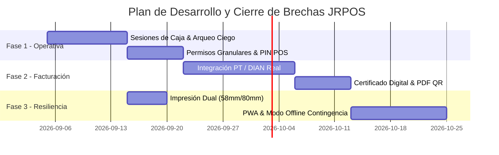

# JRPOS — Auditoría de Brechas Técnicas, Deuda y Hoja de Ruta

> **Fecha de Auditoría:** Septiembre 2026  
> **Versión del Sistema:** JRPOS v1.4  
> **Alcance:** Frontend (React 19, Tailwind, Framer Motion), Backend (FastAPI, SQLAlchemy Async, SQLite/PostgreSQL), Integraciones Fiscales y Operativas.

---

## 1. Resumen Ejecutivo del Estado del Sistema

JRPOS cuenta con un núcleo operativo robusto para comercio minorista y mayorista (POS táctil, lector de código de barras, OCR de facturas con Gemini AI, control de fiados/créditos, gastos y reportes básicos). Sin embargo, existen brechas clave para alcanzar el nivel de producción masiva con validación fiscal ante la DIAN y resiliencia offline.

| Área | Estado Actual | Nivel de Madurez | Prioridad de Resolución |
|---|---|---|---|
| **Facturación Electrónica DIAN** | Simulación sintética (CUFE SHA-256 + XML UBL básico) | 🧪 Prototipo / Sandbox | 🔴 Alta |
| **Arqueo y Sesiones de Caja** | Recogidas de efectivo puntuales | 🟡 Parcial | 🔴 Alta |
| **Permisos y Multi-Caja** | Roles `admin` / `cajero` en JWT httpOnly | 🟡 Funcional básico | 🟡 Media |
| **Órdenes de Venta / Cotizaciones** | CRUD base de documentos | 🟡 Funcional | 🟡 Media |
| **Modo Contingencia / Offline** | Dependiente 100% de backend | ⚪ No iniciado | 🟡 Media |
| **Impresión Térmica** | Formato fijo 58mm | 🟡 Funcional | 🟢 Baja |
| **Notificaciones WhatsApp** | Manual | ⚪ No iniciado | 🟢 Baja |

---

## 2. Detalle de Brechas Técnicas y Deudas

### 2.1 Facturación Electrónica y Normativa DIAN (Colombia)
- **Brecha Actual**: Los endpoints `/api/electronic/*` y `backend/dian_client.py` calculan CUFE y generan XML UBL 2.1 en modo simulado local sin firma digital X.509 real ni transmisión SOAP a la DIAN.
- **Acciones Requeridas**:
  1. Integrar cliente SOAP o API REST de Proveedor Tecnológico (PT) avalado por la DIAN (ej. The Factory HKA, Alegra API, Facture) o conexión directa mediante WebService DIAN.
  2. Implementar módulo de carga y almacenamiento seguro de certificados digitales (`.p12` / `.pfx`) con encriptación de clave privada.
  3. Soporte para eventos de Facturación Electrónica como Título Valor (RADIAN): Acuse de recibo, Recibo de bienes/servicios y Aceptación expresa.
  4. Generación y descarga de la Representación Gráfica oficial en PDF con código QR bidimensional DIAN y validación en catálogo público.

### 2.2 Control de Caja, Turnos y Prevención de Fugas
- **Brecha Actual**: Se registran recogidas de efectivo individuales, pero no existe el ciclo de **Turnos / Sesiones de Caja**.
- **Acciones Requeridas**:
  1. Tabla `cash_sessions` con: Monto base de apertura, fecha/hora inicio, cajero asignado, estado (`open` / `closed`).
  2. Al cierre de turno: **Conteo ciego de efectivo**, cálculo automático del saldo esperado vs saldo contado, desglose por billetes/monedas y registro de diferencias (sobrantes/faltantes).
  3. Emisión del **Reporte Z de Cierre Fiscal** en tirilla térmica.

### 2.3 Seguridad, Permisos Granulares y Multi-Terminal
- **Brecha Actual**: Los cajeros tienen acceso a varios módulos secundarios o visualización de márgenes de ganancia en algunas vistas.
- **Acciones Requeridas**:
  1. Matriz de permisos granulares por módulo (POS, Inventario, Clientes, Reportes, Configuración, Carga Masiva).
  2. Modo **PIN de Desbloqueo Rápido** en la pantalla del POS para cambio ágil de cajero sin cerrar la sesión de la terminal.
  3. Consecutivos y numeraciones independientes por caja física (Caja 1, Caja 2, etc.).

### 2.4 Documentos Comerciales y Circuitos de Venta
- **Brecha Actual**: Las cotizaciones y remisiones se crean de forma aislada.
- **Acciones Requeridas**:
  1. Botón de **"Convertir a Venta POS"** con un clic desde Cotizaciones y Remisiones (carga directa al carrito con aplicación de descuentos guardados).
  2. Gestión de garantías vinculada al serial o número de factura de la venta original con reingreso automático o desecho de inventario.

### 2.5 Resiliencia Operativa y Modo Offline (PWA)
- **Brecha Actual**: Si la conexión a internet o el servidor local falla, el punto de cobro queda bloqueado.
- **Acciones Requeridas**:
  1. Configuración de Service Worker con almacenamiento en `IndexedDB` para almacenar productos e indexar códigos de barra localmente.
  2. Cola de sincronización (*Background Sync*) para emitir ventas locales con consecutivo de contingencia y sincronizar con el backend al recuperar señal.

---

## 3. Plan de Mitigación y Cronograma Sugerido

